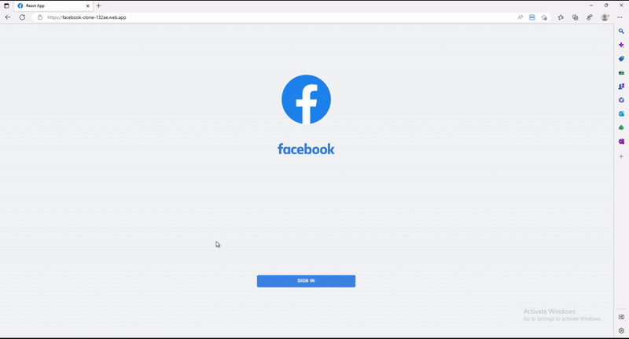
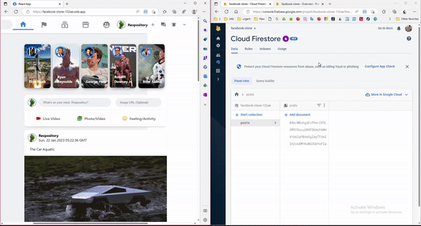
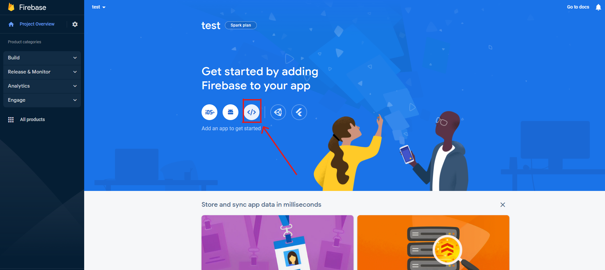
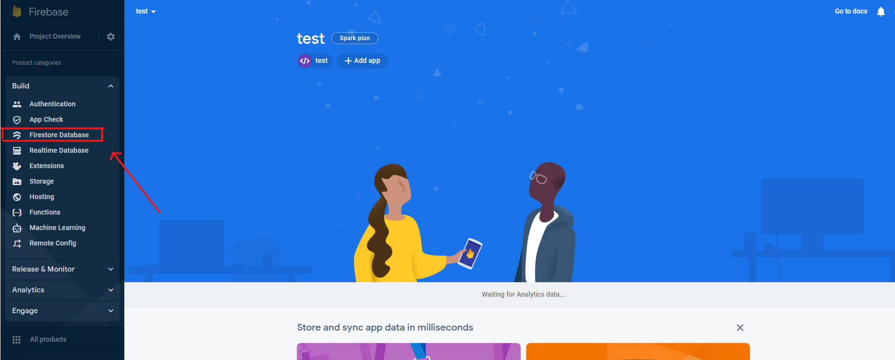
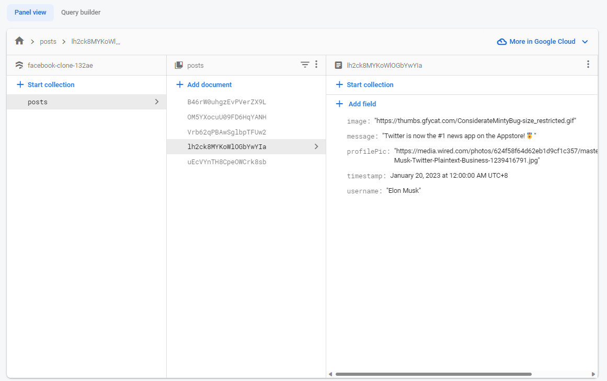

<p align="center">
  <a href="https://facebook-clone-132ae.web.app">
    
  </a>
</p>
<h2 align="center">
  Official Facebook Clone: Interactive Clone With React JS & Firebase
</h2>

<p align="center">
  <a aria-label="NPM version" href="https://nodejs.org/en/download/">
    
  </a>
  <a aria-label="License" href="https://github.com/vercel/next.js/blob/canary/license.md">
    
  </a>
  <a aria-label="Make a Pull Request" href="http://makeapullrequest.com">
    
  </a>
</p>

<p align="center">
  
</p>

--------------------
> This clone is built with [React](https://reactjs.org/) as the Frontend Framework and uses [Firebase](https://firebase.google.com/) for Google Authentication, Real-time Database Updates, and Cloud Hosting

- **Cloud Authentication:** Uses Google's Authentication Service to set Facebook's default poster as your account and imports your profile information (name, profilePic, timeZone) into the build.

<p align="center">
  
</p>

- **Real-time Database Updates:** Uses [React Hooks](https://reactjs.org/docs/hooks-intro.html) and [Firestore DB](https://firebase.google.com/docs/firestore) to update the feed and story reel with real-time snapshots from the collection of posts in the cloud. 

<p align="center">
  
</p>

## Demo Live @ https://facebook-clone-132ae.web.app

## Testing & Hosting the Application on localhost

> Clone this repository and change the working directory.
```
git clone https://github.com/rexpository/facebook-clone.git
cd facebook-clone
```
> Install the dependencies in the local node_modules folder.
```
npm install
```
> Setup a firebase app and provide your own firebaseConfig in `src/firebase.js`
- Go to the [Firebase Console](https://console.firebase.google.com/u/0/) and click "Add project"
- Configure your project setup as you wish, but make sure you enable Google Analytics
- Create a Web app on firebase:

<p align="center">
  
</p>

- While configuring your Web app, select "set up Firebase Hosting" and "use npm"
- Create a Firestore database in your Web app:

<p align="center">
  
</p>

- While configuring your Web app, select "start in production mode"
- Start a collection in your database and set the Collection ID as "posts"
- For each post entry, autogenerate the Document ID with Auto-ID, and enter the following Fields & a value of your choice: `image` `message` `profilePic` `timestamp` `username`. Note: the Field Type for `timestamp` should be set to "timestamp" instead of "string". 

<p align="center">
  
</p>

- After setting up your database, go to your project settings and scroll down to find your firebaseConfig constants, which should look something like this:
```javascript
const firebaseConfig = {
  apiKey: "SAMPLEKEY",
  authDomain: "test123.firebaseapp.com",
  projectId: "test123",
  storageBucket: "test123.appspot.com",
  messagingSenderId: "12345678",
  appId: "1:1234567:web:12345678",
  measurementId: "SAMPLEID"
};
```
- Replace the constants in `src/firebase.js` with your own firebaseConfig constants to link your firebase database to the build
> Compile and host the application on localhost:3000
```
npm run start
```


### Building & Hosting the Application on Firebase

- cd...
- npm i -g firebase-tools

- firebase login
(Log in through google)

- firebase init
- select "Hosting: configure files for Firebase Hosting"
- select "Use an existing project"
- select your Firebase project from the list
- set public directory as "build"
- configure as a single-page app: Yes
- set up automatic builds with Github: No

- npm run build

- firebase deploy