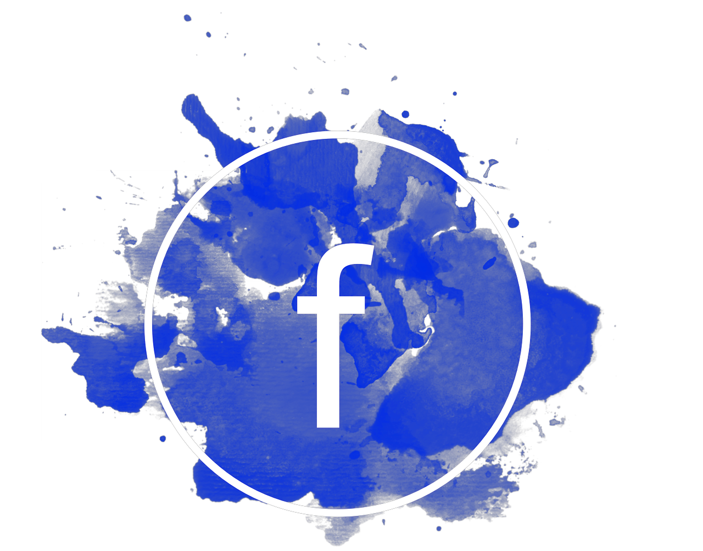

  

<h2 align="center">
  Facebook Clone: Official Interactive Clone With React JS & Firebase
</h2>

  
  
  

  

--------------------
> This clone is built with [React](https://reactjs.org/) as the Frontend Framework and uses [Firebase](https://firebase.google.com/) for Google Authentication, Real-time Database Updates, and Cloud Hosting

- **Cloud Authentication:** Uses Google's Authentication Service to set Facebook's default poster as your account and imports your profile information (name, profilePic, timeZone) into the build.

  

- **Real-time Database Updates:** Uses [React Hooks](https://reactjs.org/docs/hooks-intro.html) and [Firestore DB](https://firebase.google.com/docs/firestore) to update the feed and story reel with real-time snapshots from the collection of posts in the cloud. 

  

### Description:

- You need to provide your own firebaseConfig in `src/firebase.js`

  Go to `https://console.firebase.google.com/u/0/` and make `new project`

  Add `Web` as firebase app then go to `Firestore Database` and create new one.

  Add `collections` - `messages` with message / timestamp / username

  and `posts` - with image / message / profilePic / timestamp / username

  Go to Project settings -> General and you should have all credentials you need.\

### Live Demo Online @ https://facebook-clone-132ae.web.app

### Deploying the application on localhost

- cd...
- npm install
- change `src/firebase.js` -> firebaseConfig to your own
- npm run start

### Building and hosting the application

- cd...
- npm i -g firebase-tools

- firebase login
(Log in through google)

- firebase init
- select "Hosting: configure files for Firebase Hosting"
- select "Use an existing project"
- select your Firebase project from the list
- set public directory as "build"
- configure as a single-page app: Yes
- set up automatic builds with Github: No

- npm run build

- firebase deploy